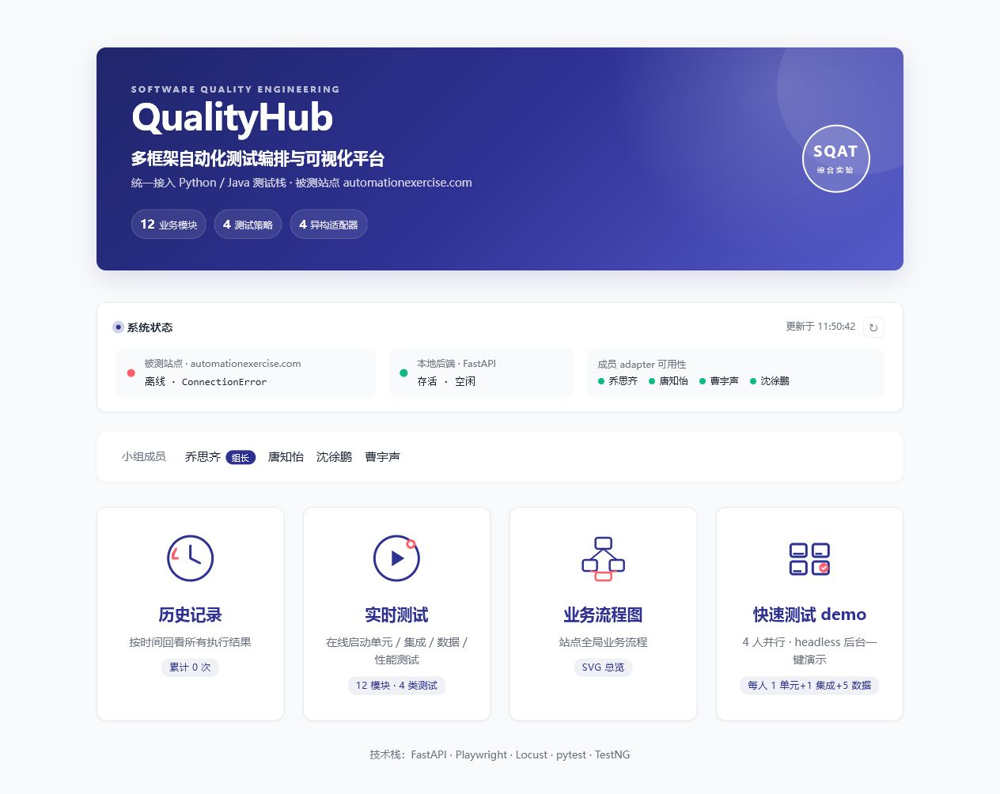
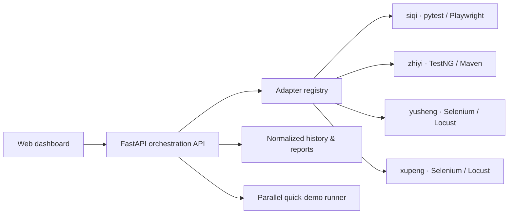

<div align="center">

# QualityHub

### Multi-framework software quality assurance and test orchestration

One interface for functional, integration, combinatorial, and performance testing<br>
across Python and Java test stacks.

[](https://www.python.org/)
[](https://fastapi.tiangolo.com/)
[](https://playwright.dev/)
[](https://testng.org/)
[](https://locust.io/)

</div>



## Why this project

QualityHub turns four independently developed browser-testing suites into one coherent quality platform. Instead of running scripts from separate folders, a user can discover test capabilities, configure parameters, launch tests, monitor availability, and review normalized results from a single web dashboard.

The system targets [Automation Exercise](https://automationexercise.com/) and covers 12 business modules through four complementary testing strategies:

| Scope | Coverage |
| --- | --- |
| Functional testing | Account, catalogue, cart, contact, category, and subscription workflows |
| Integration testing | Whitelisted cross-module user journeys with depths of 3–5 |
| Combinatorial testing | Data-driven and pairwise-style input combinations |
| Performance testing | Locust and Java HTTP workloads with configurable execution parameters |

## System design



Each member-facing adapter implements the same contract and returns a normalized `TestResult`. This isolates framework-specific execution details from the dashboard and makes the UI independent of pytest, TestNG, Selenium, Playwright, or Locust.

Key engineering features include:

- a shared adapter protocol for heterogeneous Python and Java test suites;
- a registry-driven catalogue for 12 modules and cross-module integration paths;
- one-click parallel demo execution with per-run artifacts and a merged report;
- runtime monitoring for the system under test, backend, and all four adapters;
- guarded execution to prevent conflicting browser and load-test runs;
- persistent, filterable test history with links to generated HTML reports.

## My contribution — Qiao Siqi

I served as team lead and owned both an individual testing scope and the shared system that brought the four contributors' work together.

- Designed and implemented the product-list, product-detail, and product-search test suite in `comprehensive-experiments/siqi/`.
- Integrated the four independently developed test stacks and defined the common interface exposed to the orchestration layer.
- Designed the adapter protocol, registry, normalized result model, and integration-path catalogue.
- Built the FastAPI backend, single-page dashboard, monitoring panel, history views, flow visualization, and quick-demo experience.
- Coordinated the final system architecture and all shared project-level work outside the other three contributors' individual folders.

## Team ownership

| Contributor | Primary individual scope |
| --- | --- |
| **Qiao Siqi (team lead)** | Product browsing tests; shared architecture, integration, interfaces, backend, and dashboard |
| Tang Zhiyi | Registration, login, and logout; Java/TestNG test stack |
| Cao Yusheng | Cart add, quantity, and removal workflows |
| Shen Xupeng | Contact, category filtering, and subscription workflows |

The member directories preserve each contributor's original implementation choices. The shared `UI/` layer integrates them without requiring the individual suites to use the same language or framework.

## Explore the repository

```text
comprehensive-experiments/
├── UI/                  # Shared FastAPI orchestration and web dashboard
├── siqi/                # Product browsing tests
├── zhiyi/               # Account tests (Java / TestNG / Maven)
├── yusheng/             # Cart tests
├── xupeng/              # Contact, category, and subscription tests
└── Arrangement.md       # Original assignment and test ownership
```

Useful entry points:

- [`UI/server/adapters/base.py`](comprehensive-experiments/UI/server/adapters/base.py) — shared adapter contract and result model
- [`UI/server/main.py`](comprehensive-experiments/UI/server/main.py) — orchestration API
- [`UI/server/demo.py`](comprehensive-experiments/UI/server/demo.py) — parallel demonstration runner
- [`UI/web/static/app.js`](comprehensive-experiments/UI/web/static/app.js) — dependency-free single-page dashboard
- [`UI/docs/integration_paths.md`](comprehensive-experiments/UI/docs/integration_paths.md) — cross-module integration catalogue

## Run locally

On Windows:

```bat
cd comprehensive-experiments\UI
setup.bat
start.bat
```

Then open [http://localhost:8000](http://localhost:8000).

The setup script creates an isolated virtual environment, installs the Python dependencies and Playwright Chromium, and keeps generated reports and runtime history out of version control. Live tests access a public demonstration website; use the quick demo only when network access is available.

## 中文简介

QualityHub 是一个面向软件质量保证课程综合实验的多框架测试编排平台。项目将四位成员分别使用 pytest、Playwright、Selenium、Locust、TestNG 和 Maven 编写的测试套件，通过统一 adapter 接口接入 FastAPI 后端，并提供可视化页面来启动测试、查看状态、筛选历史记录和生成汇总报告。

乔思齐除负责 `siqi/` 中的商品列表、商品详情和商品搜索测试外，还承担了四人工作的统合、统一接口抽象、共享后端、HTML 展示页面、系统监控、历史记录和快速演示等其他公共部分。
