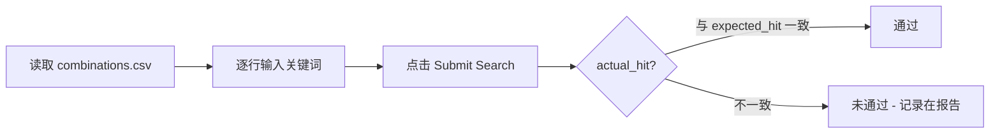

# TC-DataCombination — 数据组合测试（搜索功能）

## 概述

| 字段 | 内容 |
|---|---|
| 功能描述 | 商品搜索（多维输入组合） |
| 用例目的 | 用 pairwise 方法用最少用例覆盖搜索输入的多维正交性，验证健壮性 |
| 用例编号 | TC-DataCombination-01 ~ TC-DataCombination-25 |
| 前提条件 | 数据来源 `testdata/combinations.csv`，由 `scripts/generate_combinations.py` 生成 |

### 数据维度

| 维度 | 取值 |
|---|---|
| 关键词词根 | dress / shirt / top / jeans / noresult123 |
| 大小写变换 | lower / upper / title / mixed |
| 前后空格 | clean / leading / trailing |
| 长度修剪 | full / partial |

笛卡尔积共 5 × 4 × 3 × 2 = 120 种，pairwise 压缩到 **20 组**；再加 **5 组边界用例**（空字符串、纯数字、纯符号、HTML 注入、超长字符串），共 **25 组**。

### 业务流程图

### 测试步骤（每行数据相同）

| # | 输入 / 动作 | 期望的输出 / 响应 | 是否通过判定 |
|---|---|---|---|
| 1 | 打开 `/products` | 列表加载 | 必须 |
| 2 | 输入 CSV 当前行的 keyword | 输入回显 | 必须 |
| 3 | 点击 Submit | 出现 Searched Products 或不触发导航 | 容错 |
| 4 | 统计结果数 → actual_hit = (count > 0) | — | — |
| 5 | 断言 actual_hit == expected_hit | 相等 | 通过；否则未通过 |

### 自动化脚本

`tests/test_data_combination.py::test_data_combo_搜索关键词组合`

### 25 组结果汇总

完整 25 行见 `testdata/combinations.csv`。**通过 21 组、未通过 4 组**。未通过用例如下：

| 用例编号 | keyword | expected_hit | actual_hit | 是否通过 | 备注 |
|---|---|---|---|---|---|
| DC-02 | `'  SHIRT'` | True | False | 未通过 | pairwise: shirt / upper / leading / full |
| DC-08 | `'  t'` | True | False | 未通过 | pairwise: top / lower / leading / partial |
| DC-11 | `'  dR'` | True | False | 未通过 | pairwise: dress / mixed / leading / partial |
| DC-14 | `'  Je'` | True | False | 未通过 | pairwise: jeans / title / leading / partial |

### 测试发现

4 个失败用例的**共性**：全部为带 **leading whitespace** 的输入。

对照组：

- **trailing whitespace** 全部通过（`"shirt  "` 等）
- **大小写变换** 全部通过（搜索是大小写不敏感的）
- **子串匹配** 全部通过（输入 "dr" 也能命中 "dress"）

**结论**：automationexercise.com 搜索接口对输入未做 `lstrip`，前导空格被当作有效字符参与匹配；后导空格则被正确剥离。建议被测系统在搜索前对输入做 `str.strip()`。

### 人工复现截图

`docs/manual_screenshots/data_combination/TC-DataCombination/`
- `pass_DC-01.png` — 一组通过的代表
- `fail_DC-02.png` — 一组失败的代表（前导空格 SHIRT 无结果）
