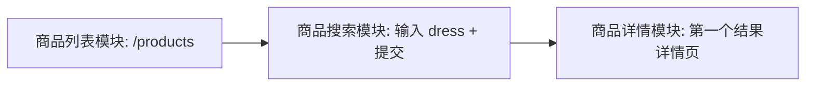
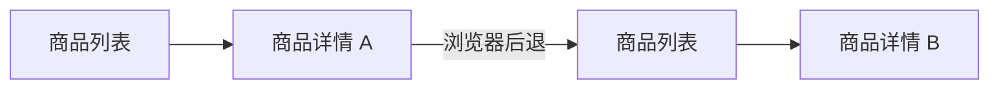
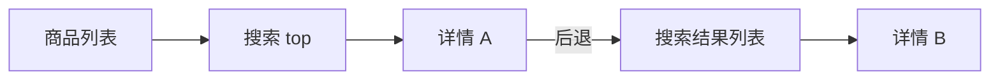

# TC-Integration — 集成模块测试（路径深度 3 / 4 / 5）

三组集成测试，路径深度递增，覆盖商品列表、商品搜索、商品详情三个模块的协同。

---

## TC-Integration-Depth3-01

| 字段 | 内容 |
|---|---|
| 功能描述 | 列表 → 搜索 → 详情 三模块串联 |
| 用例目的 | 验证用户在列表页发起搜索并打开任一结果的端到端流程 |
| 用例编号 | TC-Integration-Depth3-01 |
| 前提条件 | 站点可达；关键词 "dress" 至少能命中 1 个商品 |
| 路径深度 | **3**（列表 → 搜索 → 详情） |

### 业务流程图

### 测试步骤

| # | 输入 / 动作 | 期望的输出 / 响应 | 实际情况 | 是否通过 |
|---|---|---|---|---|
| 1 | 节点 1：打开 `/products` | 列表页加载，All Products 标题可见，商品卡片 > 0 | 加载正常 | 通过 |
| 2 | 节点 2：输入 "dress" 点击 Submit | 出现 Searched Products 标题，结果数 > 0 | 正常显示 | 通过 |
| 3 | 节点 3：点击第 1 个结果的 View Product | 跳转到详情页，名称与价格可见 | 跳转成功 | 通过 |

### 自动化脚本

`tests/test_integration_depth3.py::test_integration_depth3_搜索后进入商品详情`

### 人工复现截图

`docs/manual_screenshots/integration/TC-Integration-Depth3-01/`
- `step1_列表.png`
- `step2_搜索结果.png`
- `step3_详情.png`

---

## TC-Integration-Depth4-01

| 字段 | 内容 |
|---|---|
| 功能描述 | 列表 → 详情 A → 回退 → 详情 B |
| 用例目的 | 验证浏览器历史回退后能再次进入不同商品的详情 |
| 用例编号 | TC-Integration-Depth4-01 |
| 前提条件 | 列表至少有 2 个商品 |
| 路径深度 | **4** |

### 业务流程图

### 测试步骤

| # | 输入 / 动作 | 期望的输出 / 响应 | 实际情况 | 是否通过 |
|---|---|---|---|---|
| 1 | 节点 1：打开 `/products` | 列表加载，商品 ≥ 2 | 正常 | 通过 |
| 2 | 节点 2：点击第 1 个商品 View Product | 进入详情 A，记录商品名 name_a | 进入并取到名称 | 通过 |
| 3 | 节点 3：浏览器后退 | 回到 `/products`，All Products 标题可见 | 回退成功 | 通过 |
| 4 | 节点 4：点击第 2 个商品 View Product | 进入详情 B，name_b ≠ name_a | 商品不同 | 通过 |

### 自动化脚本

`tests/test_integration_depth4.py::test_integration_depth4_列表与详情来回切换`

### 人工复现截图

`docs/manual_screenshots/integration/TC-Integration-Depth4-01/`

---

## TC-Integration-Depth5-01

| 字段 | 内容 |
|---|---|
| 功能描述 | 列表 → 搜索 → 详情 A → 回退到搜索结果 → 详情 B |
| 用例目的 | 验证在搜索结果集中切换浏览多个商品详情的能力 |
| 用例编号 | TC-Integration-Depth5-01 |
| 前提条件 | 关键词 "top" 至少返回 2 个结果 |
| 路径深度 | **5** |

### 业务流程图

### 测试步骤

| # | 输入 / 动作 | 期望的输出 / 响应 | 实际情况 | 是否通过 |
|---|---|---|---|---|
| 1 | 节点 1：打开 `/products` | 列表加载 | 正常 | 通过 |
| 2 | 节点 2：输入 "top" 点击 Submit | Searched Products 可见，结果 ≥ 2 | 正常 | 通过 |
| 3 | 节点 3：点击第 1 个结果 | 进入详情 A，取 name_a | 正常 | 通过 |
| 4 | 节点 4：浏览器后退 | 回到搜索结果，Searched Products 标题仍可见 | 正常 | 通过 |
| 5 | 节点 5：点击第 2 个结果 | 进入详情 B，name_b ≠ name_a | 正常 | 通过 |

### 自动化脚本

`tests/test_integration_depth5.py::test_integration_depth5_搜索结果中切换两次详情`

### 人工复现截图

`docs/manual_screenshots/integration/TC-Integration-Depth5-01/`
