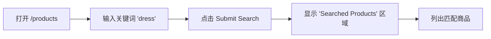

# TC-Search — 商品搜索模块单测

## TC-Search-01

| 字段 | 内容 |
|---|---|
| 功能描述 | 商品搜索 |
| 用例目的 | 验证输入有效关键词后能正确返回相关商品 |
| 用例编号 | TC-Search-01 |
| 前提条件 | 网络可达 `http://automationexercise.com`，浏览器空白态 |

### 业务流程图

### 测试步骤

| # | 输入 / 动作 | 期望的输出 / 响应 | 实际情况 | 是否通过 |
|---|---|---|---|---|
| 1 | 浏览器导航至 `/products` | 页面加载完成，可见 "All Products" 标题 | 加载正常，标题可见 | 通过 |
| 2 | 在搜索框（`#search_product`）输入 `dress` | 输入内容正确显示 | 输入回显正常 | 通过 |
| 3 | 点击 Submit Search（`#submit_search`） | 页面切换为搜索结果，出现 "Searched Products" 标题，至少 1 个商品 | 标题可见，结果数 > 0 | 通过 |

### 自动化脚本

`tests/test_unit_search.py::test_search_01_关键词命中商品`

### 人工复现截图

放置于 `docs/manual_screenshots/unit/TC-Search-01/`，至少包含：

- `step1_列表页打开.png`
- `step2_输入关键词.png`
- `step3_搜索结果显示.png`
